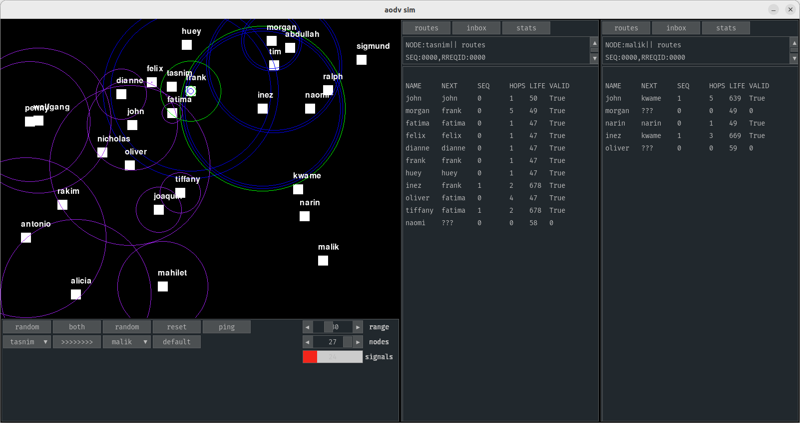

# aodv_sim

## description

- AODV routing simulation with [pygame](https://www.pygame.org) and [pygame_gui](https://pygame-gui.readthedocs.io/en/latest/quick_start.html).
- planning to implement IRL in micropython eventually, so limited python featureset
- wip, protocol not quite done/working yet

## instructions

### install
- `pip3 install -r requirements.txt`
- OR: `pip3 install pygame pygame_gui`

or use a venv, or whatever.

### run
- `python3 main.py`
- use gui to send data
- click node to see its contents
- press 'r' to reset random node positions