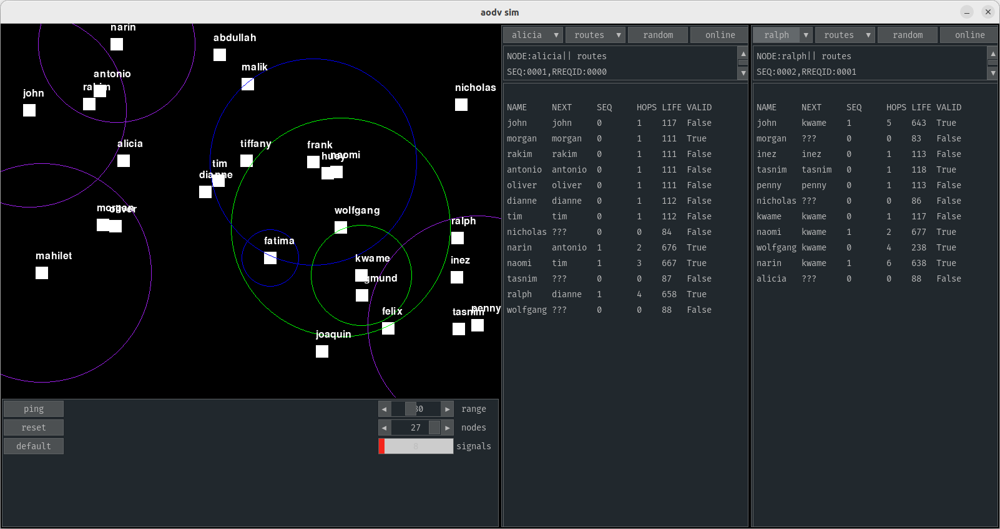

# aodv_sim

## description

- AODV(ish) routing simulation with [pygame](https://www.pygame.org) and [pygame_gui](https://pygame-gui.readthedocs.io/en/latest/quick_start.html).
- planning to implement IRL in micropython eventually, so limited python featureset
- work in progress

## instructions

### install
- `pip3 install -r requirements.txt`
- OR: `pip3 install pygame pygame_gui`

or use a venv, or whatever.

### run
- `python3 main.py`
- use gui
- left click node to drag / show node ranges
- right click node to disable
- keyboard commands:
  - exit : `esc`
  - pause : `space`
  - ping : `p`
  - reset nodes (keep current settings) : `r`
  - reset nodes (restore default settings) : `d`
  - swap sender / receiver : `s`
  - randomize sender : `q`
  - randomize receiver : `e`
  - randomize both : `w`
  - toggle sender online : `z`
  - toggle receiver online : `x`
  - view mode: routes : `1`
  - view mode: neighbors : `2`
  - view mode: inbox : `3`
  - view mode: log : `4`